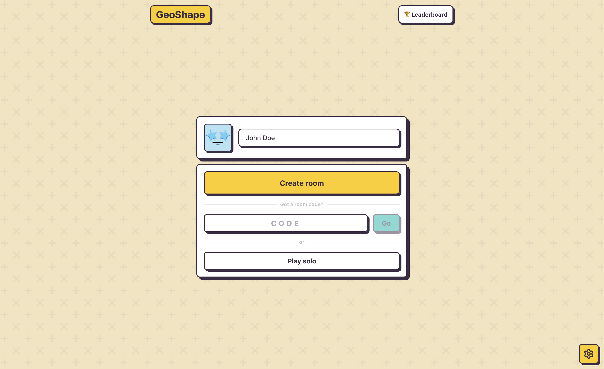
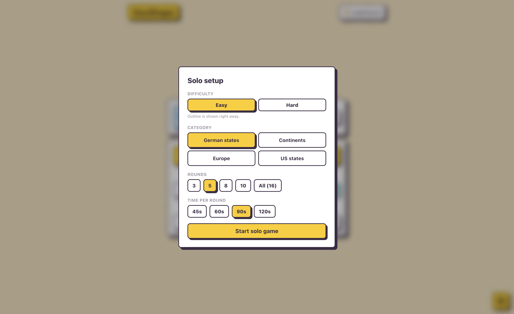

<p align="center">
    
    <br>
    v1.2.0
</p>

## GeoShape

A browser multiplayer guessing game. Name the country, continent or state from its bare outline before the timer runs out.

## 💪 Features

- **Solo & multiplayer** — play alone or share a 4-letter room code with friends
- **Four categories** — German states, European countries, continents and US states
- **Easy & hard** difficulty
- **Persistent stats & global leaderboard** — wins, games played and best scores (SQLite)
- **No accounts** — just pick a name and an avatar

## 🖼️ Impressions

<table>
  <tr>
    <td></td>
    <td></td>
  </tr>
  <tr>
    <td></td>
    <td></td>
  </tr>
</table>

## 📦 Installation

Clone the repository:

```bash
git clone https://codeberg.org/doen1el/geo-shape
cd geo-shape
```

### Run with Docker

```bash
docker compose up -d --build
```

The game is then available at `http://localhost:3000`.

## 🚀 Contributing

You can of course open issues for bugs, feedback, and feature ideas. All suggestions are very welcome :)

## 💻 Local development

Clone the repository:
```bash
git clone https://codeberg.org/doen1el/geo-shape
cd geo-shape
```

Install dependencies:

```bash
npm install
```

Run the development server:
```bash
pnpm dev
```

## 📜 Credits

- [NaturalEarth](https://www.naturalearthdata.com/)
- [DiceBear](https://www.dicebear.com/)
- [Svelte](https://svelte.dev/)
- [NodeJS](https://nodejs.org/)
- [SQLite](https://www.sqlite.org/index.html)
