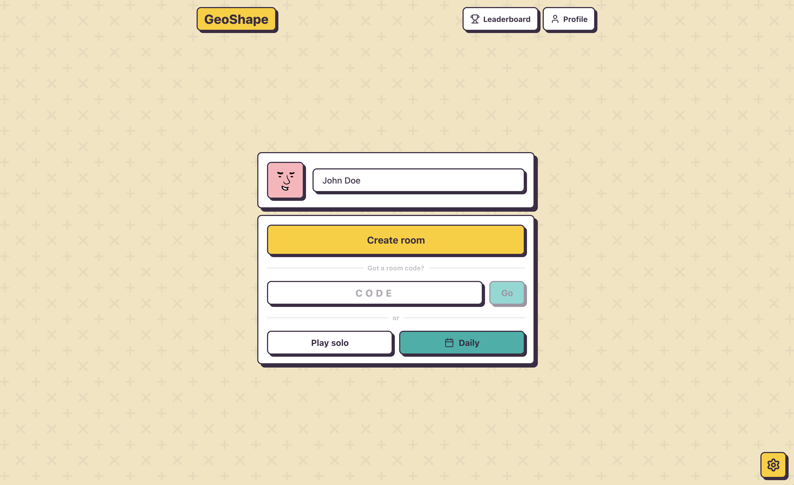
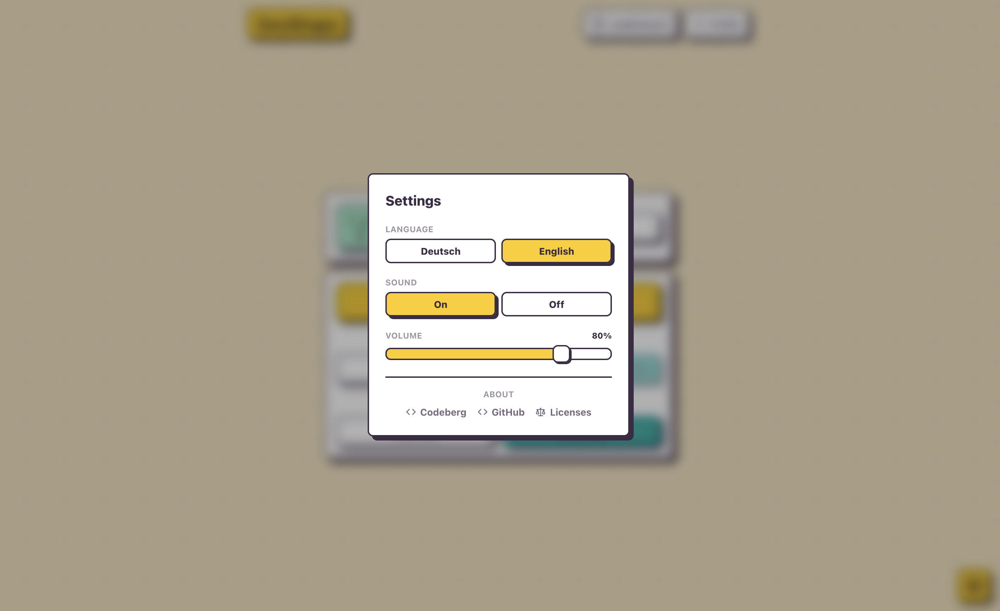
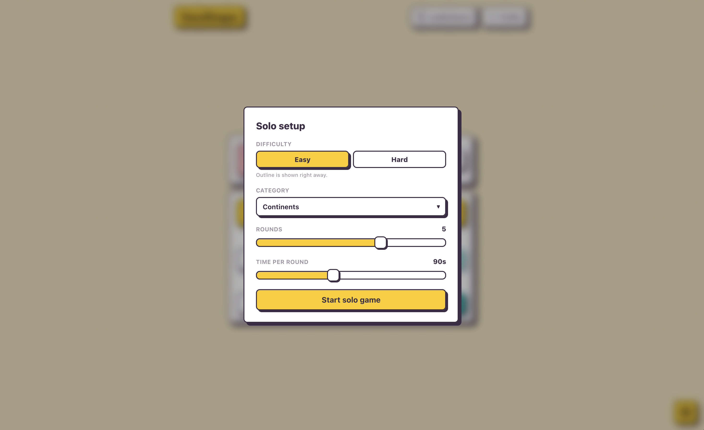
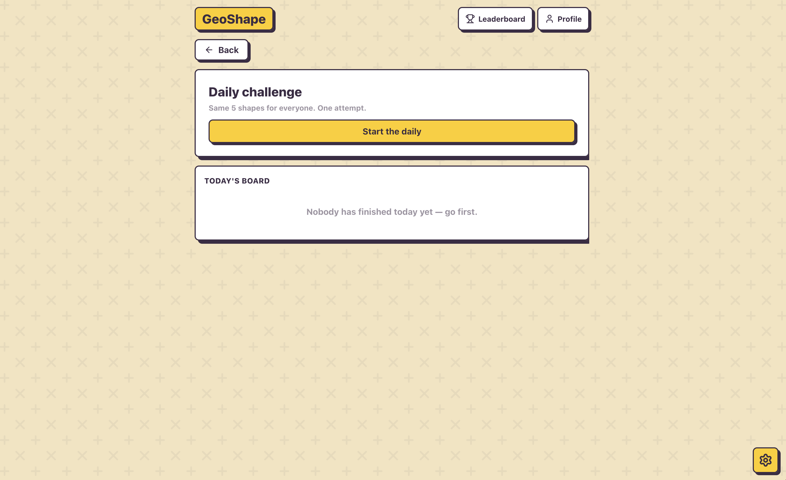
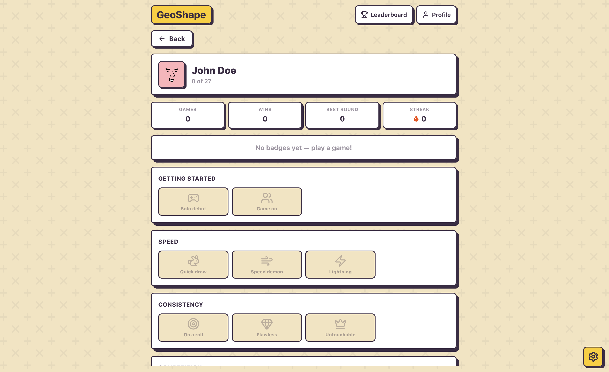
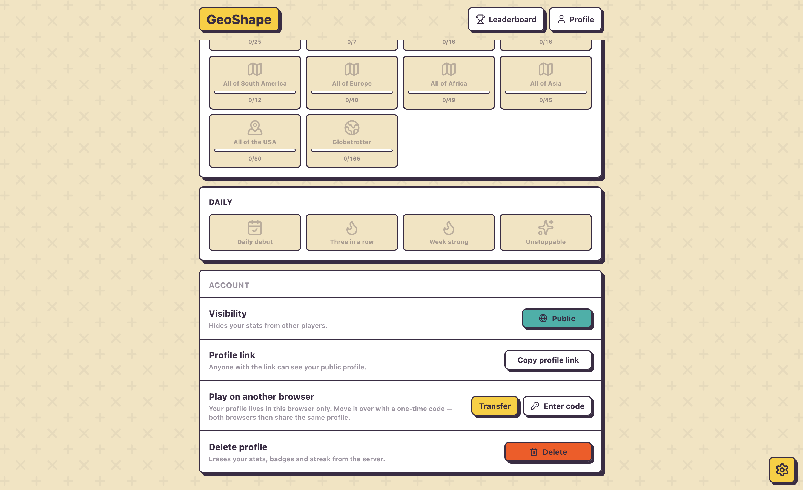
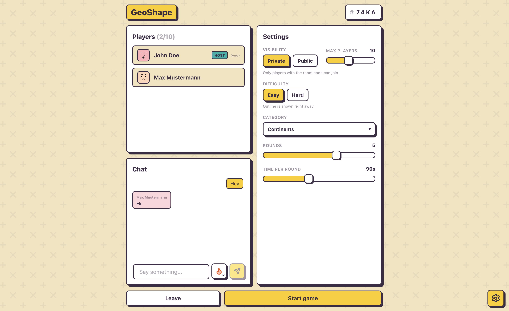
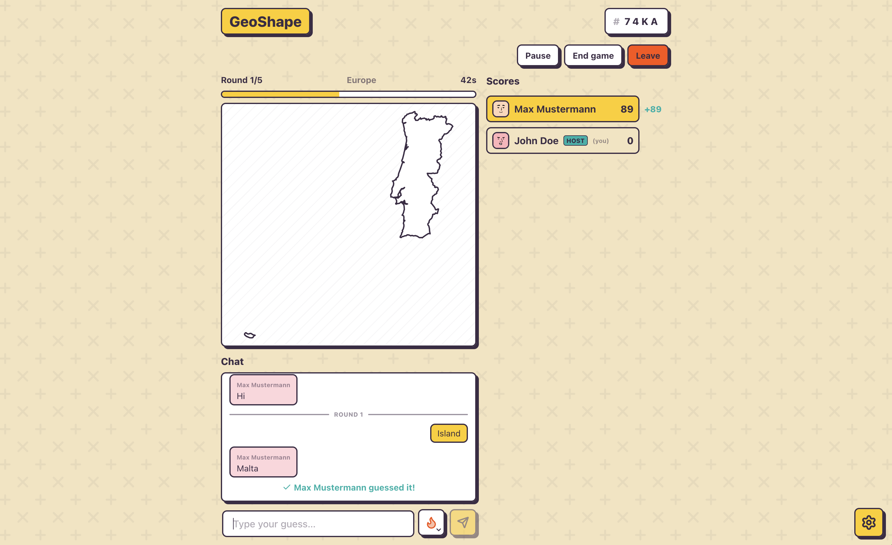
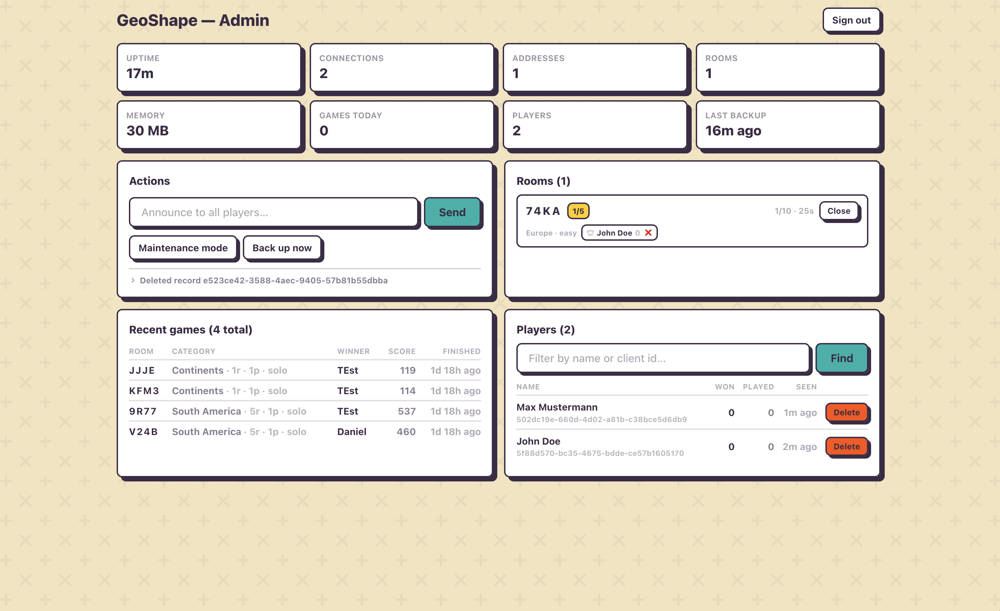

<p align="center">
    
    <br>
    v1.4.1
</p>

## GeoShape

A browser multiplayer guessing game. Name the country, continent or state from its bare outline before the timer runs out.

## 💪 Features

- **Solo & multiplayer** — play alone or share a 4-letter room code with friends
- **Daily challenge** — a new challenge every day, with a global leaderboard
- **Multiple categories** — German states, US states, countries and continents
- **Easy & hard** difficulty
- **Persistent stats & global leaderboard** — wins, games played and best scores
- **No accounts** — just pick a name and an avatar
- **Admin panel** — manage rooms, users and games
- **Settings menu** — change language and sound settings

## 🖼️ Impressions

<table>
  <tr>
    <td></td>
    <td></td>
  </tr>
  <tr>
    <td></td>
    <td></td>
  </tr>
  <tr>
    <td></td>
    <td></td>
  </tr>
  <tr>
    <td></td>
    <td></td>
  </tr>
  <tr>
    <td></td>
  </tr>
</table>

## 📦 Installation

Clone the repository:

```bash
git clone https://codeberg.org/doen1el/geo-shape
cd geo-shape
```

### Run with Docker

Edit the docker-compose.yml:

- Set the `GEOSHAPE_ADMIN_TOKEN` environment variable to a secure value. This token is used to access the admin panel.
- Set the `GEOSHAPE_SECRET` environment variable to a secure value. This secret is used for signing cookies and other sensitive data.
- Set the `GEOSHAPE_ALLOWED_ORIGINS` environment variable to a comma-separated list of allowed origins. This is used for CORS.
- Set the `GEOSHAPE_TRUST_PROXY` environment variable to `1` if you are running behind a reverse proxy.

Then run the following command to build and start the application:

```bash
docker compose up -d --build
```

The game is then available at `http://localhost:3000`.

## 🚀 Contributing

You can of course open issues for bugs, feedback, and feature ideas. All suggestions are very welcome :)

## 💻 Local development

Clone the repository:
```bash
git clone https://codeberg.org/doen1el/geo-shape
cd geo-shape
```

Install dependencies:

```bash
npm install
```

Run the development server:
```bash
GEOSHAPE_ADMIN_TOKEN=dev-token pnpm dev 
```

## 📜 Credits

- [NaturalEarth](https://www.naturalearthdata.com/)
- [DiceBear](https://www.dicebear.com/)
- [Svelte](https://svelte.dev/)
- [NodeJS](https://nodejs.org/)
- [SQLite](https://www.sqlite.org/index.html)
